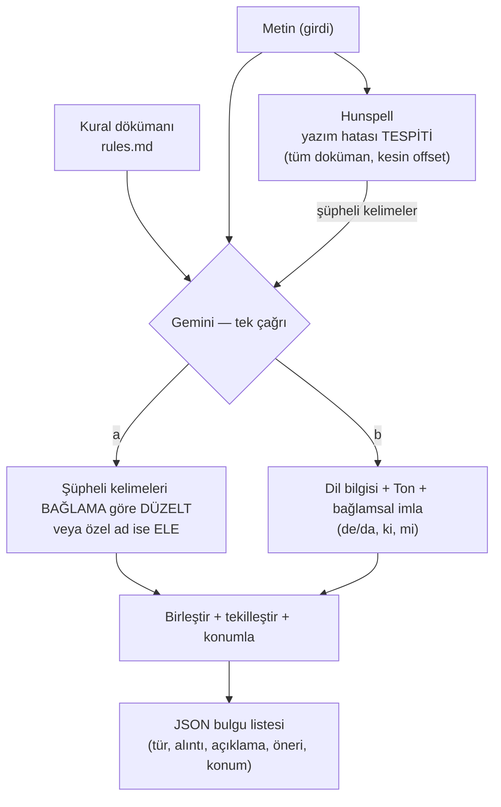

# Türkçe Doküman Dil Analizi

Türkçe kurumsal metinleri **imla**, **dil bilgisi** ve **ton** eksenlerinde
inceleyip her sorun için **gerekçe + düzeltme önerisi** üreten hibrit bir sistem.
Sistem **önerir, düzeltmez**; son söz kullanıcıdadır.

Çekirdek felsefe: **deterministik olarak çözülebilen işi araca, yargı/bağlam
gerektiren işi yapay zekâya** bırakan bir hibrit. Yazım hatalarını yerel bir
sözlük (Hunspell) **kesin** biçimde bulur; düzeltme önerisini, dil bilgisini ve
tonu ise bağlamı anlayan bir LLM (Gemini) üretir.

Mimari, ileride **RAG**'e ve üretimde **self-host / kapalı ağ (air-gap)** ortamına
*kod değişmeden* büyüyecek şekilde tasarlandı.

---

## Ne yapıyor?

- **İmla** — yazım hataları, eksik Türkçe karakter, bağlama bağlı yazım (de/da, ki, mi).
- **Dil bilgisi** — özne-yüklem/tamlama uyumu, anlatım bozuklukları.
- **Ton** — kurumsal/resmî yazışmaya uygunluk, üslup tutarlılığı.
- Her bulgu: **tür, alıntı, açıklama, öneri, kural kimliği, metindeki konum (offset)**.
- Çıktı: makine-işlenebilir **JSON** (rapora veya arayüze dönüşebilir).

---

## Algoritma akışı



Tek cümlede: **tespit = Hunspell (deterministik), düzeltme + yargı = Gemini.**
Hunspell sözlükte olmayan kelimeleri bulur; Gemini bunları cümlenin akışına göre
düzeltir ya da "bu bir özel ad, hata değil" diyerek eler, ayrıca dil bilgisi ve
tonu analiz eder. İki kaynağın bulguları birleştirilir, çakışanlar tekilleştirilir.

---

## Neden her noktada yapay zeka kullanmadık?

Bu, projenin en bilinçli kararı. Mantık şöyle:

| İş türü | Kim yapar | Neden |
|---|---|---|
| Sözlükteki yazım hatası (var/yok) | **Hunspell (araç)** | Hızlı, ücretsiz, **sıfır halüsinasyon**, tamamen yerel. Sözlük temelli; uydurmaz. |
| Düzeltme önerisi, dil bilgisi, ton, özel-ad ayırt etme | **Gemini (LLM)** | Cümlenin akışını/anlamını gerektirir; araçla çözülemez. |

Bunu **ölçerek** öğrendik. İmla denetimini LLM'e bıraktığımızda model olmayan
hatalar uyduruyordu (örn. doğru olan "yalnız mı"yı "yalnız mu" yapmak, cümle
ortasındaki "sabah"ı gereksizce büyük harfe çevirmek). Aynı işi sözlüğe
(Hunspell) devredince **imla precision'ı 1.00'a** çıktı ve bu uydurmalar bitti.

Tersi de doğru: yazım denetçisinin önerileri zayıftı ("gonderecegim →
gönderecekler" gibi yanlış), çünkü araç bağlama bakmaz. Önerileri Gemini'ye
ürettirince bağlama uygun hale geldi ("gonderecegim → göndereceğim").

Özetle:
- **Her yere LLM koymak** = gereksiz maliyet, gecikme, kota tüketimi ve
  halüsinasyon riski.
- **Her yere kural koymak** = dili asla tam kapsayamama + prompt şişince modelin
  dikkatinin dağılması (bunu da denedik, kural dökümanını büyütünce recall düştü).
- **Hibrit** = her işi onu en iyi yapan araca vermek. Karar sezgiyle değil, altın
  set üzerinde **ölçümle** verildi.

---

## Yolculuk: buraya gelene kadar ne yaptık, nerede ne kullandık?

| Faz | Ne yaptık | Kullanılan |
|---|---|---|
| **1** | Prompt-first çekirdek: kısa metni alıp JSON bulgu üreten motor | Python, LangChain-core, Gemini, Pydantic (katı JSON şema), sağlayıcı + kural kaynağı "seam"leri |
| **1.5** | Kalibrasyon: yanlış-pozitifleri ölçüp düşürme | Altın set (`eval/`), "düzeltme yoksa ele" filtresi, disk önbelleği (kota tasarrufu), dayanıklı eval |
| **4 (denenen→terk)** | Deterministik imla için **Zemberek-python** denendi | Saf-Python port; ama vasat çıktı (`yanlız`, `herşey`, `Yarin` gibi hataları kaçırdı, çoğu kelimeyi geçerli sandı) → **terk edildi** |
| **4 (kullanılan)** | Deterministik imla tespiti | **Hunspell (spylls, saf-Python) + LibreOffice tr_TR sözlüğü** |
| **4.5** | Akıllı düzeltme: Hunspell bulur, Gemini bağlama göre düzeltir + özel-ad eler | Gemini (tek çağrıda imla düzeltme + dil bilgisi + ton); ton sıkılaştırma; eval'de tür yumuşatma |

**Güncel sonuç (altın set):** genel precision **0.93**, imla precision **1.00**,
temiz metinlerde yanlış-pozitif **0**.

> Not: Zemberek artık projede **kullanılmıyor** — yukarıdaki tabloda yalnız
> "denendi ve terk edildi" olarak yer alır.

---

## Teknoloji yığını (güncel)

| Bileşen | Seçim | Rol |
|---|---|---|
| LLM | **Gemini** (varsayılan `gemini-2.5-flash-lite`; `.env`'de `MODEL_ID` ile değişir) | Düzeltme önerisi, dil bilgisi, ton, bağlamsal imla, özel-ad ayırma |
| Deterministik imla | **Hunspell** (`spylls`, saf-Python) + **tr_TR** sözlük | Yazım hatası tespiti (yerel, sıfır halüsinasyon) |
| Orkestrasyon / soyutlama | **LangChain-core** (`BaseChatModel`, `with_structured_output`) | Sağlayıcı bağımsızlığı + katı JSON çıktı |
| Şema | **Pydantic v2** | Bulgu/şema doğrulama |
| Önbellek | Disk (`.cache/llm_cache.json`) | Kota tasarrufu + tekrarlanabilirlik |
| Test/ölçüm | **pytest** + altın set (`eval/`) | Birim test + precision/recall |

Tasarım ilkeleri: **modüler + pinli bağımlılık** (air-gap'te mirror'lanabilsin),
telemetri kapalı, gizli dış çağrı yok.

---

## Mimari "seam"leri (değiştirilebilir bağlantı noktaları)

- **Davranış / Bilgi ayrımı** — `prompt.py` yalnız modelin *davranışını* tutar;
  *kurallar* `RulesProvider` üzerinden ayrı gelir. Bugün `StaticRulesProvider`
  tüm `rules/rules.md`'yi verir; ileride aynı arayüzle RAG (retrieval) gelir,
  analyzer değişmez.
- **Sağlayıcı soyutlaması** — `providers/build_chat_model` bir LangChain
  `BaseChatModel` döndürür. Bugün Gemini; üretimde yerel vLLM aynı arayüzle.
- **Katı JSON çıktı** — `with_structured_output` parse hatasını kaldırır.
- **Offset konumlama** — `locate.py` alıntıyı kaynakta bulur; Hunspell zaten
  kesin offset üretir.

---

## Kurulum

```bash
python -m venv .venv && source .venv/bin/activate
pip install -e ".[dev]"
cp .env.example .env   # GEMINI_API_KEY değerini girin
```

### Hunspell sözlüğü (deterministik imla için gerekli)

`dicts/tr_TR.aff` ve `dicts/tr_TR.dic` gerekir (repoda tutulmaz, indirilir). Yoksa
deterministik katman otomatik devre dışı kalır (yalnız LLM çalışır).

```bash
mkdir -p dicts
curl -fsSL -o dicts/tr_TR.aff https://raw.githubusercontent.com/LibreOffice/dictionaries/master/tr_TR/tr_TR.aff
curl -fsSL -o dicts/tr_TR.dic https://raw.githubusercontent.com/LibreOffice/dictionaries/master/tr_TR/tr_TR.dic
```

Air-gap'te bu iki dosya iç ağa vendor'lanır. Yol `.env`'de `DICT_PATH` ile
değiştirilebilir. Bilinen sınır: sözlükte olmayan özel ad/yabancı kelime
yanlış-pozitif olabilir → `HunspellChecker(whitelist=...)` ile beyaz liste.

---

## Kullanım

```bash
python cli.py "Bu cümlede ki hata var ve yanlız yazılmış."
echo "uzun metin..." | python cli.py
python cli.py < belge.txt
```

Çıktı, her bulgu için `type, excerpt, explanation, suggestion, rule_id,
start/end` içeren JSON'dur. Uzun belgelerde analiz adımları `stderr`'e canlı
basılır (stdout'taki JSON saf kalır).

`.docx` da doğrudan verilebilir:

```bash
python cli.py belge.docx > sonuc.json
```

---

## Web paneli (canlı ilerleme)

Terminal yerine, analiz adımlarını **canlı** gösteren yerel bir panel:

```bash
python web/server.py        # tarayıcı açılır: http://127.0.0.1:8765
PORT=9000 python web/server.py
```

- `.docx` yükle **veya** metin yapıştır → "Analiz Et".
- Her adım canlı akar: *"Belge 5 parçaya bölündü → Parça 2/5: yazım inceleniyor →
  … → Belge geneli tutarlılık → Tamamlandı"*.
- Sonuç: bulgular metin üzerinde vurgulanır ve eksene göre (imla / dil bilgisi /
  ton / tutarlılık) gruplanmış kartlarda listelenir.

**Güvenlik / air-gap:** yalnız `127.0.0.1`'e bağlanır (dışarı açılmaz);
`GEMINI_API_KEY` sunucuda kalır, tarayıcıya gönderilmez; harici CDN/script/font
yoktur; **sıfır yeni Python bağımlılığı** (yerleşik `http.server` + SSE).

---

## Kural dökümanını değiştirme (kod değişmeden)

Kurallar [src/dilanaliz/rules/rules.md](src/dilanaliz/rules/rules.md) dosyasında
tutulur; analiz motorundan bağımsızdır:

1. **Dosya içeriğini değiştir** — `rules.md`'yi düzenle. Kod değişmez.
2. **Harici dökümana işaret et** — `.env`'de `RULES_PATH=/yol/resmi_kurallar.md`.

Döküman çok büyürse `StaticRulesProvider` yerine `RetrievalRulesProvider` (RAG)
takılır — analyzer yine değişmez.

> Kural metni değişince LLM önbellek anahtarı da değişir; sonraki çalışma taze
> API çağrısı yapar.

---

## Ölçüm (altın set)

```bash
EVAL_DELAY_SEC=0 python eval/run_eval.py   # eksen-bazlı precision/recall + temiz-metin FP
pytest                                      # API gerektirmeyen birim testler
```

`eval/golden.jsonl` elle etiketli settir (imla/gramer/ton + temiz metinler).
Prompt/kural değişiklikleri bu set üzerinde **ölçülerek** değerlendirilir. Her
çalıştırma `eval/last_predictions.json`'a tüm tahminleri yazar (kalibrasyon için).

### Önbellek ve kota

- LLM çağrıları `.cache/llm_cache.json`'a önbelleklenir: aynı metin+kural+model
  bir daha API'ye gitmez. Prompt/kural/model değişince anahtar değişir, önbellek
  kendiliğinden tazelenir. Sıfırlamak için `.cache/` silinir.
- Gemini ücretsiz katmanı **günlük** istek sınırlıdır; ücretli katmanda
  `EVAL_DELAY_SEC=0` ile beklemesiz çalışır. Model `.env`'de `MODEL_ID` ile seçilir.

### Güncel metrikler

| Eksen | Precision | Recall |
|---|---|---|
| imla | 1.00 | 0.89 |
| dil_bilgisi | 1.00 | 1.00 |
| ton | 0.80 | 0.80 |
| **GENEL** | **0.93** | **0.88** |

Temiz metinlerde yanlış-pozitif: **0**. (Altın set küçük; sayılar set büyüdükçe
güncellenir. Yanlış-pozitif, kurumsal denetçide en kritik göstergedir.)

---

## Yol haritası

- ✅ **Faz 1 / 1.5** — Prompt-first çekirdek + kalibrasyon.
- ✅ **Faz 4 / 4.5** — Hibrit motor (Hunspell tespiti + Gemini düzeltme/yargı).
- ⏭️ **Faz 3 — Uzun belge işleme (sıradaki):**
  - **Girdi:** `.docx` → eksiksiz temiz metin çıkarma (`docx2python`). Gövde
    paragraflarının yanı sıra **tablo hücreleri, metin kutuları/şekiller,
    üst/altbilgiler ve dipnot/sonnotlar** belge sırasını koruyarak okunur;
    böylece atlanan metin minimuma iner. Görsel içindeki yazı (OCR) kapsam
    dışıdır ama `ExtractionReport` ile kaç görselin okunamadığı kullanıcıya
    bildirilir (sessiz veri kaybı yok). PDF sonraki bir faza bırakıldı: çok
    sütunlu düzen + araya giren görsel metni bozar, güvenilir yol Word kaynaktır.
    *Yalnız temiz metin elde etmek için; biçim/şablon kontrolü değil.*
  - **Hiyerarşik parçalama:** bölüm/başlık (örn. `1.4`, `3.2`) → paragraf →
    cümle. Anlamlı sınırdan bölünür, cümle asla ortadan kesilmez. Bölme
    deterministik kod yapar (AI değil).
  - **Kademeli analiz — kontrol bazları:** her kontrol kendi en küçük yeterli
    biriminde değerlendirilir:
    - Yazım / Türkçe karakter → **kelime** (Hunspell, tek geçiş).
    - Noktalama / anlatım bozukluğu / dil bilgisi / bağlamsal imla → **cümle**
      (paragraf bağlamıyla beslenir).
    - Ton / üslup → **paragraf**.
    - Terim/birim tutarlılığı → **bütün belge**.
    Yani analiz tek seferde değil, bu bazlara göre **kademeli geçişlerle** yürür;
    her geçişin bulguları en sonda tek listede birleşir.
  - **Paralel analiz + tekilleştirme** (`merge_findings`).
  - **Belge-geneli tutarlılık geçişi:** bir terimin/birimin ifadesi belgenin her
    yerinde aynı mı? Parçalamanın göremediği, bütünü tarayan hafif ek geçiş
    (yukarıdaki "bütün belge" bazının uygulaması).
  - *Not:* Parçalama yalnız AI kontrolleri (noktalama, anlatım, dil bilgisi, ton)
    içindir; Hunspell deterministik olduğu için belge boyutundan etkilenmez.
- ⏸️ **Faz 2 — RAG:** kural dökümanı büyüyünce `RetrievalRulesProvider`. (Gerçek
  büyük döküman gelince; küçük dökümanda gereksiz.)
- 🔒 **Faz 8 — Self-host / air-gap:** yerel LLM (vLLM) + yerel embedding, telemetri
  kapalı, pinli bağımlılıkların iç ağa mirror'lanması.
